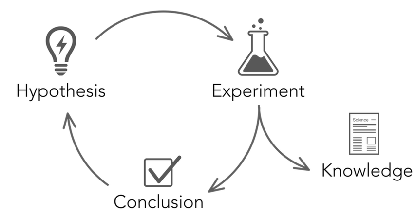
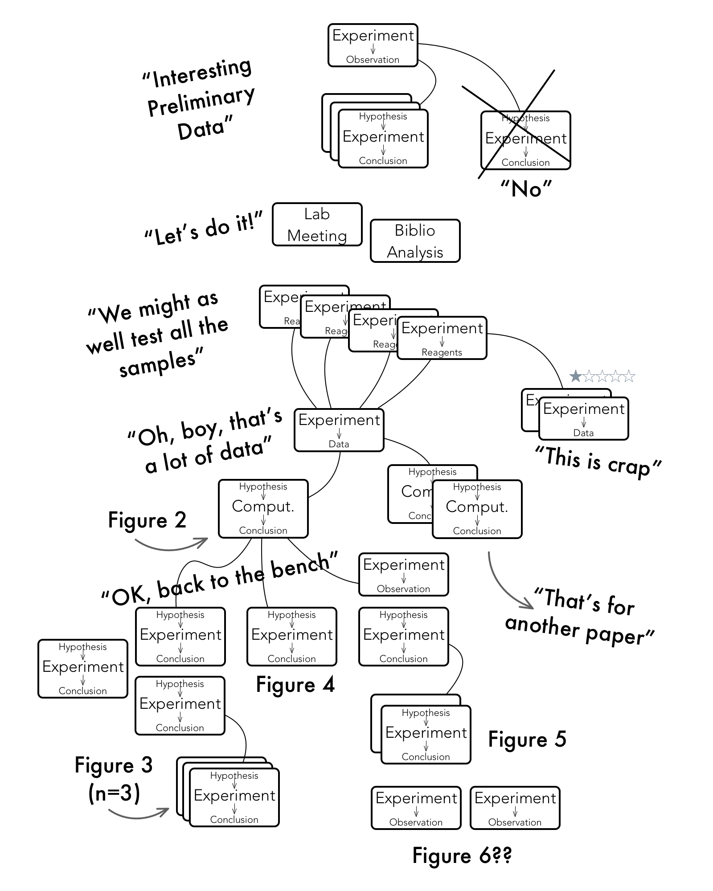

```{r setup, include=FALSE}
knitr::opts_chunk$set(echo = FALSE)
```

## Scientific Method



http://blog.findingsapp.com/posts/what-is-an-experiment.html

## Scientific Method

```{r out.height="500px",out.width="600px"}

```

## Deciding on an Experimental Question

## Ethical Considerations
Ethical considerations are integral to the initiation, conduct, and publication of experimental results.  In terms of experimental design, consider the following *3Rs* [@Fry2014-wu].

- Replacement

- Refinement

- Reduction

## Ethical Considerations

### Replacement
Does the experiment need to be performed at all or performed as envisioned?

- Literature review
    - Has the study already been done?
    - What designs have been used or proposed for similar experiments in the past?
- Are the experimental materials appropriate for the questions at hand?
    - Cell lines useful instead of animals
    - Low cost tech instead of high cost (PCR vs. Sequencing)

## Ethical Considerations

### Refinement
Does the experiment as envisioned gather appropriate data, have defined stopping rules, standard procedures, and clarity on sources of variability?

- Define important data to gather.
    - Dependent variables and independent variables may not be enough.
    - Consider confounders, technical details, ambient conditions, and metadata (date, time, machine, experimenter, etc.).
- Define when an experiment is "complete". 
- Establish standard procedures as clearly as possible.
- Define, to the extent possible, sources of variability and reliability in your approach.

## Ethical Considerations

### Reduction (or is the experiment right-sized)
Can the experiment provide reasonable results with the resources proposed?

- Is sample size appropriate?
- Are resources allocated appropriately?
- Are data sources not directly produced by the experiment included?
- Meta-analysis appropriate?

## Why design?

- To obtain valid results *from which safe and meaningful conclusions can be drawn*
- To know the extent to which results can be generalized
- To use resources efficiently
    - Overpowering (using more than required resources) and, to a greater extent, underpowering can be very costly.

# Basic Principles of Experimental Design

## Controls

## Replication

## Randomization and Avoidance of Bias

## The Experimental Unit

[@Fisher-1960]
[@Lazic2010-aa] pseudoreplication

# Design and Analysis

## *Know* how the results will be analyzed

## Signal/noise ratio

## Sources of variability and reducing them

## Blocking

## Quantify variability

- Population vs sample
- Standard Deviation
- Standard Error

## Generalizability


## 

## References {.smaller}