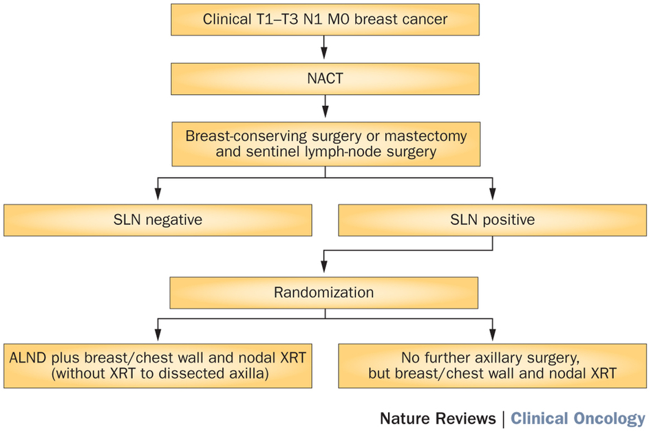
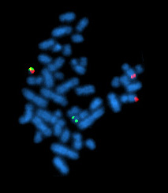
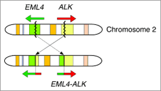
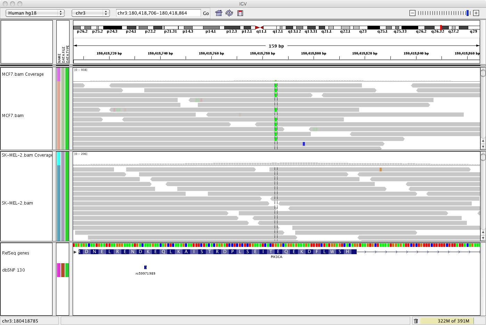

## Some Thoughts

- Lots of hype around the terminology of "Personalized" or "Precision" medicine
- Cancer diagnosis, prognosis, and treatment has a long history of being patient-based
- Bioinformatics and genomics technologies are "disruptive" in how "precision" is defined
- These new technologies are producing meaningful biological information at a pace faster than we can adapt to it

## Cancer Clinical Trials

- Oncology has a relatively long history of enrolling patients on clinical trials (studies)
- Patients are often treated based on protocols developed in clinical trials or enroll directly in a clinical trial
- Cancer clinical trials:
    - Are NOT a last resort for most patients, but first-line therapy
    - Use the current standard, best therapy and compare that to a slightly modified treatment to look for even better results
    - Contribute to an overall understanding of cancer and its treatment.

## A Clinical Trial "Schema"

## Patient Stratification

### Acute Lymphocytic Leukemia

- WBC count
- Age
- Gender
- CNS involvement
- Testicular involvement
- Down Syndrome
- Race
- Chromosomal alterations
- ALL Type (B vs. T)
- Cell markers
- Response to initial therapy

## Treatment Decisions

### Chronic Myelogenous Leukemia

## Treatment Decisions

### Non-small-cell Lung Cancer

## Next Generation Sequencing

## Precise Molecular Testing

- Test patients for genomic changes
- Bioinformatics pipelines to deliver high-quality results with fast turnaround
- Build and use large database of information about known human variation in cancer and normal biology
- Use information to help patients

## Precise Molecular Oncology

- Turn results over to panel of experts to determine for each patient:
    - Clinical meaning of genomic changes in the tumor
    - Clinical meaning of inherited variants
    - Treatment recommendations
- Break from traditional approaches (disruption) because each patient is different at the molecular level!

### These last steps are HARD

## Conclusions

- Oncology has a long history of patient-based therapy
- Clinical trials are used regularly to apply the current "best" treatment for the patient's characteristics
- New technologies bring vast amounts of information to the clinical table
    - Challenge is to use this information effectively and wisely
    
  

